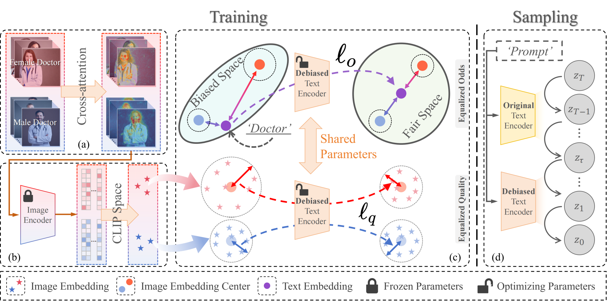

<div align="center">
  
</div>

# LightFair: Towards an Efficient Alternative for Fair T2I Diffusion via Debiasing Pre-trained Text Encoders (NeurIPS 2025)

<p align="center">
<a href="" target='_blank'>

</a>
</p>
**Author:** [Boyu Han](https://boyuh.github.io/), [Qianqian Xu*](https://qianqianxu010.github.io/), [Shilong Bao](https://statusrank.github.io/), [Zhiyong Yang](https://joshuaas.github.io/), [Kangli Zi](https://scholar.google.com/citations?user=JlmFymcAAAAJ&hl=zh-CN&oi=ao), [Qingming Huang*](https://qmhuang-ucas.github.io/)



## ✨ Updates

[2025-9-18] 🔥 Our paper has been accepted to `NeurIPS 2025`.

## 🔜 TODOs

- [ ] Release training and evaluation codes of LightFiar.
- [ ] Release pre-training weights of LightFiar.

## ✒️ Citation

If you find our work inspiring or use our codebase in your research, please cite our work.

```
@inproceedings{han2024aucseg,
    title={LightFair: Towards an Efficient Alternative for Fair T2I Diffusion via Debiasing Pre-trained Text Encoders}, 
    author={Boyu Han and Qianqian Xu and Shilong Bao and Zhiyong Yang and Kangli Zi and Qingming Huang},
    booktitle={Advances in Neural Information Processing Systems},
    year={2025}
}
```

## 💬 Contact

If you find any issues or plan to contribute back bug-fixes, please contact us by Boyu Han (Email: hanboyu23z@ict.ac.cn).
